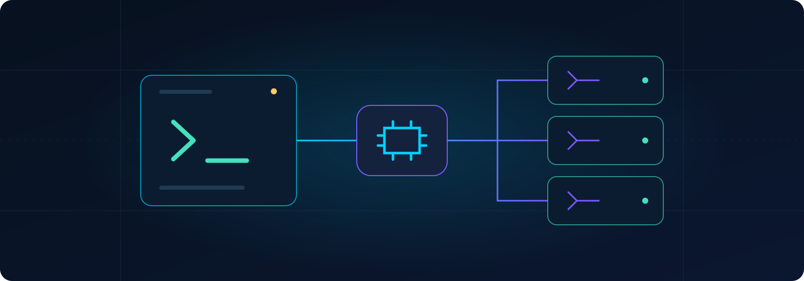
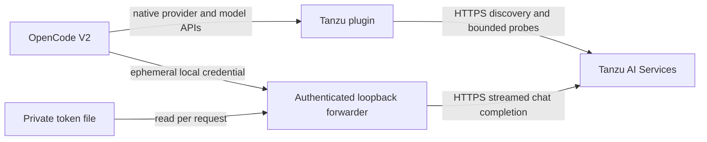

# opencode-tanzu

**Your OpenCode V2 agent. Your Tanzu models. One native provider.**

[](https://github.com/nkuhn-vmw/opencode-tanzu/releases)
[](https://github.com/nkuhn-vmw/opencode-tanzu/actions/workflows/test.yml)
[](docs/validation-standalone-v2.md)
[](LICENSE)

[Mac getting started](docs/getting-started-mac-tanzu.md) · [Quick start](#quick-start) · [Adoption checklist](#what-an-adopter-needs) · [Configuration](docs/opencode-v2.md#configuration-and-model-limits) · [Validation](docs/validation-standalone-v2.md) · [Security](SECURITY.md)

Connect OpenCode to your Tanzu AI Services deployment through its
OpenAI-compatible endpoint. The native provider discovers chat models, checks
served limits, and puts them in OpenCode's model picker. Plain JavaScript,
no additional plugin runtime dependencies, no plugin build step.

**Community project; not supported by Broadcom/VMware.** Plugin **0.5.1** is
verified with OpenCode **2.0.18**. Other runtime versions and desktop embedded
backends need their own validation.

| Discover the roster | Keep credentials private | Preserve your settings |
| --- | --- | --- |
| Chat models refresh automatically; embeddings and rerankers stay out of the picker. | Token files are reread for each request, allowing rotation without a restart. | Native provider, model and variant body overrides win over bundled sampling defaults. |

## Quick start

New to the setup? Follow the [MacBook getting-started guide](docs/getting-started-mac-tanzu.md)
to install OpenCode V2, create a Tanzu AI service instance and key, and verify
your first model response and tool call.

Start with an installed **OpenCode V2** executable and a service key supplied by
your platform operator. The installer does **not** install OpenCode itself.

```bash
brew install nkuhn-vmw/tap/opencode-tanzu
opencode-tanzu-install --runtime v2

export OPENCODE_V2_BIN='/absolute/path/to/your/v2/opencode'
export TANZU_GENAI_BASE_URL='https://genai.example.com/instance/openai/v1'
export TANZU_GENAI_API_KEY_FILE="$HOME/.config/tanzu/api-key"

opencode-tanzu-v2 --version
opencode-tanzu-v2 models
opencode-tanzu-v2
```

Replace the example paths and endpoint. The token file must already contain the
raw API key, with mode **0600** in a private **0700** directory. Obtain the URL
from the service key's `endpoint.api_base`, appending `/openai/v1` once; obtain
the token from `endpoint.api_key` (sometimes under `credentials`). Never paste
credentials into committed config or shell command arguments.

No provider JSON is needed for this path. Choose a discovered Tanzu model in
OpenCode. For source installation, CA trust, project installs and credential
migration, follow the [V2 setup guide](docs/opencode-v2.md).

**Desktop users:** the wrapper selects an isolated backend configuration. Connect
your desktop client to that backend; installing here does not modify the
client's embedded backend. Finish or pause active sessions before restarting a
shared service. Use `--standalone` for initial checks.

## What an adopter needs

| Requirement | Included? | What to supply |
| --- | --- | --- |
| Native V2 provider, discovery, capability metadata, cache and credential transport | Yes | Installed together by Homebrew or `install.sh`. |
| Isolated CLI launcher | Yes | `opencode-tanzu-v2`; select the V2 executable with `OPENCODE_V2_BIN`. |
| OpenCode runtime | No | OpenCode V2; 2.0.18 is the verified version. |
| Tanzu AI Services endpoint and models | No | A reachable OpenAI-compatible endpoint with at least one chat model. |
| Credentials | No | An authorized service-key token; token file recommended. |
| Private CA trust | No, when required | Set `NODE_EXTRA_CA_CERTS` to your approved PEM CA bundle before launch. |
| Desktop backend connection | No, when using a desktop client | Connect to the configured backend and validate its runtime/plugin scope. |
| CF deployment, application authentication, MCP tools or loop guard | No | Optional integrations supplied by the [buildpack](https://github.com/nkuhn-vmw/opencode-buildpack). |

You do not need a CF application, buildpack, `VCAP_SERVICES` or CF CLI merely to
use this provider. Your operator handles credential provisioning and renewal.
Node 20+ is required for repository tests; the plugin runs inside OpenCode.

**Adoption check:** confirm the V2 version, list models, complete one inference,
then complete one harmless tool call with the model you intend to use.
[Copyable checks and troubleshooting](docs/opencode-v2.md#verify-and-troubleshoot)
separate discovery from inference and tool execution.

## Proven behavior, with limits

On **2026-10-01**, plugin 0.5.1 and OpenCode 2.0.18 completed real Mac
background-service inference in two project scopes. Short Qwen and DeepSeek
shell `printf` tool calls returned their markers. Native request checks also
confirmed sampling defaults and explicit provider/model/variant overrides.
The regression suite passed 154 checks.

These results establish the tested integration and short tool flows. They do
not guarantee long-session reliability for every model. Laguna's observed
long-history tool-argument failure remains under investigation. See the
[validation record](docs/validation-standalone-v2.md) for test scope and
historical results.

## Architecture



The foundation key stays out of the native model catalog and generated config.
The forwarder rejects redirects and only accepts authenticated chat-completion
POSTs. OpenCode executes tools on its host. Your selected model receives prompts
and tool results at the configured endpoint; the plugin does not enforce a
system-wide data-egress policy. See [security and trust boundaries](SECURITY.md).

## Models

The V2 provider probes known names as well as new IDs: a model-card maximum is
not proof of the serving configuration. Without a verified served limit, it
uses conservative context/output limits of at most **8192/4096**. Explicit
positive native model limits are retained, with output clamped to context.

The roster refreshes every five minutes without overlapping refreshes. Failed
refreshes retain an existing/configured roster; an initial failure without
configured models leaves no usable Tanzu models. A visible model is not proof
that its credentials still work.

Sampling precedence is **bundled defaults → environment defaults → provider
body → model body → selected variant body**. Explicit zero and null fields are
preserved. `OPENCODE_TANZU_MODEL_OPTIONS_JSON` changes defaults. The same native
model converter is used by the CF V2 buildpack.

[Model limits, sampling configuration and transport details](docs/opencode-v2.md#configuration-and-model-limits)

## Documentation and companion integrations

- [MacBook getting started](docs/getting-started-mac-tanzu.md): runtime install, CF service provisioning, private credentials and first use.
- [V2 operator guide](docs/opencode-v2.md): install, isolation, rotation, migration, limits and troubleshooting.
- [Validation record](docs/validation-standalone-v2.md): what actually passed and what remains unproven.
- [Documentation map](docs/README.md): current guides and historical design notes.
- [Changelog](CHANGELOG.md): release behavior and migration context.
- [CF buildpack](https://github.com/nkuhn-vmw/opencode-buildpack): remote OpenCode, CF lifecycle and optional Tanzu platform bindings.
- [Foundation launcher](https://github.com/nkuhn-vmw/opencode-on-tnz): optional foundation selection and credential provisioning.
- [Legacy V1 reference](docs/legacy-v1.md): historical compatibility only; new installs use V2.

## Contributing

Run `npm test` with Node 20+; no dependency installation is needed. See
[contributing](CONTRIBUTING.md) for focused validation and safe bug reports.
Never include service keys, authorization headers, private routes or session
prompt bodies in public issues.

Licensed under [Apache-2.0](LICENSE).
